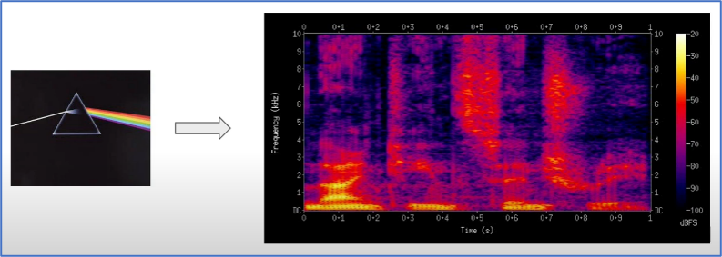

# Music Emotion Detection with Human-Interpretable Mid-Level Features


Links to all my other __`music technology projects`__ (electronic instruments, AI-powered music signal processing software etc.) are at [http://jeffreyluo.com/#mt](http://jeffreyluo.com/#mt).

## 1. Project context
Our "Song of Storms" production experience confirmed the criticality of ensuring __`machines’ participation won’t affect`__ the __`authenticity`__ and __`artistic integrity`__ of performances’ __`emotional expression`__. Machines’ ability to detect musicians’ __`dynamic emotions`__ is a crucial step, yet very challenging with the traditional __`static rule-based signal processing`__. The use of AI for detecting emotions in music has emerged as a key focus in academic research. __`AI-based emotion detection`__ typically involves training machine learning models, particularly neural networks, on large datasets of music that have been pre-labeled with various emotional states. The process generally includes these steps:
- __Data Collection__: Compile a diverse dataset of music pieces, each annotated with specific emotional labels like happiness, sadness, anger, etc.
- __Feature Extraction__: Analyze and extract features from the music that are relevant to emotion, such as tempo, pitch, rhythm, harmony, and dynamics.
- __Model Training__: Train a machine learning model, such as a neural network, using this labeled dataset. The model learns to associate specific musical features with corresponding emotions.
- __Validation and Testing__: Test the model on a separate set of data to validate its accuracy in predicting emotional content.
- __Application__: Implement the trained model in emotion detection applications.

## 2. Project objective
Excited by AI-powered emotion detection research, I studied an emotion classification algorithm based on a Visual Geometry Group (VGG)-style neural network. By using music's spectrogram representation as input, and training the VGG model to recognize human-interpretable, mid-level perceptual features (e.g., melodiousness, dissonance, and tonal stability, etc.) from the spectrogram, the algorithm can rate emotions by linearly combining the mid-level feature predictions. For instance, the rating of "happy emotion"=0.42x"tonal_stability" + 0.37x"rhythm_complexity" + 0.18x"articulation" - 0.46x"dissonance" - 0.41x"modality" - 0.16x"rhythm_stability". 

## 3. Project details
This section provides a detailed explanation of the AI model, and a step-by-step guide to applying the model for emotion detection.

This project is based on an AI-powered music emotion recognition research paper--[Towards Explainable Music Emotion Recognition: The Route via Mid-level Features](https://arxiv.org/pdf/1907.03572) by S. Chowdhury et al. The model tries to give a musically meaningful and intuitive explanation for its music emotion predictions. A VGG-style deep neural network has been adopted to classify emotional characteristics of a musical piece together with (and based on) human-interpretable, mid-level perceptual features.

### 3.1 Music data preprocessing

In terms of preprocessing, audio samples are initially transformed into 149-point spectrograms. These are derived from 10-second segments randomly chosen from the original audio. The samples are resampled at a frequency of 22.05 kHz, with each frame comprising 2048 samples and a frame rate set at 31.25 frames per second. Before creating the logarithmic-scaled spectrogram, the audio's amplitude is normalized. This process produces input vectors with dimensions of 313x149, which are then utilized as inputs for the subsequent model architectures.

### 3.2 Mid-level features


Perceptual mid-level features is defined in [A datadriven approach to mid-level perceptual musical feature modeling](https://arxiv.org/pdf/1806.04903.pdf) by A. Aljanaki et al., along with questions that were provided to human raters to help them interpret the concepts. (The ratings were collected in a pairwise comparison scenario.)


### 3.2 VGG-style neural network
VGGNet was invented by Visual Geometry Group (by Oxford University). This architecture was the 1st runner up of ILSVR2014 in the classification task while the winner is GoogLeNet. This tutorial [Introduction to VGGNet](https://becominghuman.ai/what-is-the-vgg-neural-network-a590caa72643) is a good source if you are interested in the detailed VGG architecture.


### 3.3 Emotion detection architecture
The research explored three distinct methods for emotion modeling in audio, each utilizing VGG-style convolutional neural networks (CNNs). The specifics of these architectures are illustrated in the following figure. Across all models, an Adam optimizer with a learning rate set at 0.0005 and a batch size of 8 was employed. Additionally, to mitigate overfitting, early stopping was implemented, set to trigger after 50 epochs without improvement.


- __"A2E"__: The simplest approach, where spectrograms are directly fed into a VGG-style CNN to predict emotion values from audio. This is depicted as the leftmost path in the figure.
- __"A2Mid2E"__: Aimed at achieving a more interpretable model, this middle path uses a VGG-style network to first predict mid-level features from audio, followed by a linear regression model that predicts 8 emotion ratings from 7 mid-level feature values. This corresponds to a fully connected layer with 7 inputs and 8 outputs.
- __"A2Mid2E-Joint"__: The rightmost path in the figure, this model jointly learns to predict mid-level features and emotion ratings. It predicts emotions directly from the mid-level features through a linear layer. The network yields two outputs: one from the penultimate "mid-level layer" and another from the final "emotion layer." Both outputs' losses are calculated, and the combined loss (their summation) is optimized.

The following figure illustrates the key concept of mapping mid-level features to emotions (happy, sad, tender, fearful, angry, valence, energy, tension). For instance, the rating of "emotion of happiness"=0.42x"tonal_stability" + 0.37x"rhythm_complexity" + 0.18x"articulation" - 0.46x"dissonance" - 0.41x"modality" - 0.16x"rhythm_stability". With this mapping, explainability is achieved because one can relate the emotion score to the 7 human-interpretable mid-level features.

For example, an __`excess of dissonance`__ in a musical composition tends to result in a __`low happiness`__ score, which is __`logically consistent`__.


### 3.4 Mid-level features to emotion score mapping results
The paper compares the three model architectures (A2E, A2Mid2E, A2Mid2E-Joint) on the full task of classifying emotion from audio. The A2E model serves as reference for the subsequent models with explainable linear layers. The classification accuracy results can be found in the table below.


The key conclusion is A2Mid2E-Joint comes very close to the reference model of A2E, with just 0.01 drop in accuracy in exchange for explainability. Hence I have decided to choose both A2E and A2Mid2E-Joint for my experimentations.

## 4. My implementation and experimentation
### 4.1 Datasets used
For the datasets, we utilized Aljanaki & Soleymani's [Mid-level Perceptual Features dataset](https://osf.io/5aupt/) for mid-level feature annotations. For the emotion prediction experiments, the [Music and emotion stimulus dataset](https://osf.io/p6vkg/) was employed. This dataset includes a collection of music and participants ratings of emotions for a selected short clips of film soundtracks that have been used to study emotion recognition and induction in music ([A comparison of the discrete and dimensional models of emotion in music. Psychology of Music, 39(1), 18-49](https://doi.org/10.1177/0305735610362821), Eerola and Vuoskoski, 2011).

### 4.2 Model Summary
The orginal [Github source codes](https://github.com/Jarvis1000x/Music_Emotion_Recognition) released together with the research paper are broken. I've rewriten the codes, based on the algorithm described in the research paper and the AI courses I've taken from Inspirit AI camp, particularly focusing on CNN, which is the fundamental architecture in VGG.

```
Model: "sequential_2"
_________________________________________________________________
 Layer (type)                Output Shape              Param #   
=================================================================
 conv2d_27 (Conv2D)          (None, 155, 73, 64)       1664      
                                                                 
 batch_normalization_27 (Ba  (None, 155, 73, 64)       256       
 tchNormalization)                                               
                                                                 
 conv2d_28 (Conv2D)          (None, 155, 73, 64)       36928     
                                                                 
 batch_normalization_28 (Ba  (None, 155, 73, 64)       256       
 tchNormalization)                                               
                                                                 
 max_pooling2d_6 (MaxPoolin  (None, 77, 36, 64)        0         
 g2D)                                                            
                                                                 
 dropout_6 (Dropout)         (None, 77, 36, 64)        0         
                                                                 
 conv2d_29 (Conv2D)          (None, 77, 36, 128)       73856     
                                                                 
 batch_normalization_29 (Ba  (None, 77, 36, 128)       512       
 tchNormalization)                                               
                                                                 
 conv2d_30 (Conv2D)          (None, 77, 36, 128)       147584    
                                                                 
 batch_normalization_30 (Ba  (None, 77, 36, 128)       512       
 tchNormalization)                                               
                                                                 
 max_pooling2d_7 (MaxPoolin  (None, 38, 18, 128)       0         
 g2D)                                                            
                                                                 
 dropout_7 (Dropout)         (None, 38, 18, 128)       0         
                                                                 
 conv2d_31 (Conv2D)          (None, 38, 18, 256)       295168    
                                                                 
 batch_normalization_31 (Ba  (None, 38, 18, 256)       1024      
 tchNormalization)                                               
                                                                 
 conv2d_32 (Conv2D)          (None, 38, 18, 256)       590080    
                                                                 
 batch_normalization_32 (Ba  (None, 38, 18, 256)       1024      
 tchNormalization)                                               
                                                                 
 conv2d_33 (Conv2D)          (None, 38, 18, 384)       885120    
                                                                 
 batch_normalization_33 (Ba  (None, 38, 18, 384)       1536      
 tchNormalization)                                               
                                                                 
 conv2d_34 (Conv2D)          (None, 38, 18, 512)       1769984   
                                                                 
 batch_normalization_34 (Ba  (None, 38, 18, 512)       2048      
 tchNormalization)                                               
                                                                 
 conv2d_35 (Conv2D)          (None, 38, 18, 256)       1179904   
                                                                 
 batch_normalization_35 (Ba  (None, 38, 18, 256)       1024      
 tchNormalization)                                               
                                                                 
 adaptive_average_pooling2d  (None, 1, 1, 256)         0         
  (AdaptiveAveragePooling2D                                      
 )                                                               
                                                                 
 dense_4 (Dense)             (None, 1, 1, 256)         65792     
                                                                 
 dense_5 (Dense)             (None, 1, 1, 8)           2056      
                                                                 
=================================================================
``` 
### 4.3 Setup
Environment requirements:
- pytorch: install pytorch, following instruction@https://pytorch.org/get-started/locally/
- other python package: numpy, pandas, tqdm, librosa

### 4.4 File structure
```bash
.
├── data                    # data folder
├── datasets.py             # data class and dataloader class
├── demo.py                 # inference code    
├── model.py                # original model in keras, BROKEN/NOT WORKING
├── model_torch.py          # model re-written in torch
├── __pycache__   
├── sound_preprocess.py     # preprocess script, audio -> spectrograms
├── train_log               # folder to save train log
├── train.py                # model training script
└── weights                 # folder to save weights during training
```

### 4.5 Step-by-step instructions for training and inference
1. **Preprocess data**:
    Put all audio files in `data/audio` and create an output folder `data/spectrograms/` , then run the python script `sound_preprocess`:
    ```bash
    python sound_preprocess.py
    ```
2. **Train model**:
    Once data pre-process is completed, you can start the training by running
    ```bash
    python train.py
    ```
    To change dataset setting, make change in `datasets.py - build_default_dataloader` function. To change training setting, make change in `train.py - train` function

3. **Inference**:
    You can change the `sound_preprocess.py` to preprocess your data in different folders, change the code section below and rerun step 1.
    ```python
    SPECTROGRAM_SAVE_DIR = "data/spectrograms/"
    FILES_DIR = "data/audio/"
    ```
    Once spectrograms are ready, you can run `demo.py` to obtain the classification; change the following setup to use your own model (weights) and spectrograms file
    ```python
    # model path
    checkpoint_path = 'weights/best.pth'
    # target audio spectrograms path
    audio_spectrograms_path = 'data/spectrograms/001.mp3.npy'
    ```

### 4.6 Inference results
Example inference results for music 001:
```
            valence  energy   tension  anger  fear  happy  sad  tender
predicted  6.495434    7.83  1.593537    1.0   1.0   7.83  1.0     1.0
annotated  4.83        6.83     3.17    1.0    1.0   7.33  1.0     1.0
```

### 4.7 Training log

Train loss (loss/global step):

Validation loss (loss/epochs):


Best of luck! Should you run into any issues, please feel free to contact me at jeffrey.luo333@gmail.com.

Links to all my other music technology projects (electronic instruments, AI-powered music signal processing software etc.) are at [http://jeffreyluo.com/#mt](http://jeffreyluo.com/#mt).
